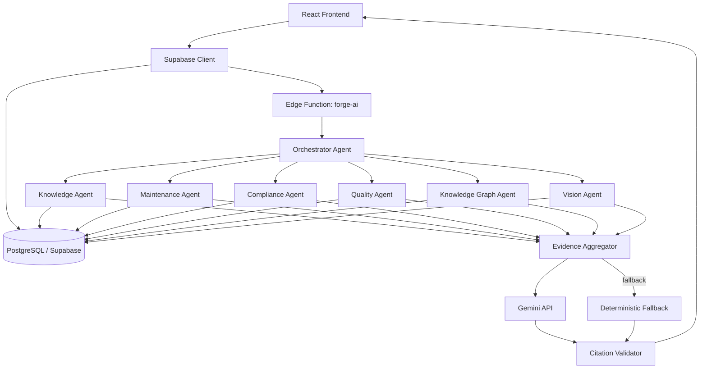

# AgentOS Intelligence

**Hackathon merge workspace:** ForgeMind knowledge/RAG foundation + AgentOS orchestration concepts.

Read **`AGENTS.md` first when opening this repo in Codex**. It contains the exact implementation priorities, current technical limitations, and target demo. See `docs/MERGE_MAP.md` for file provenance and `docs/TARGET_ARCHITECTURE.md` for the target system.

## Phase 1: Organizational RAG and shared memory

The knowledge foundation is implemented as a Supabase-backed hybrid RAG pipeline:

- real 768-dimension Gemini embeddings stored in pgvector, with HNSW cosine search and content-hash caching;
- PostgreSQL full-text retrieval, metadata filters, graph retrieval, weighted RRF, reranking, deduplication, and chunk-level citations;
- storage-backed server-side document ingestion for PDF, DOCX, PPTX, XLSX, CSV, TXT, Markdown, and images;
- evidence-traceable entity/relationship extraction plus graph-assisted retrieval;
- working and episodic organizational memory records for each RAG execution;
- `/rag-search` for retrieval diagnostics and `/memory` for execution memory.

Run `npm install`, apply `supabase/migrations/20260807000100_phase1_organizational_rag.sql`, configure Supabase Edge Function secrets, then deploy `rag-ingest` and `forge-ai`. Complete operational details, validation, and limitations are in [docs/PHASE1_COMPLETION.md](docs/PHASE1_COMPLETION.md).

---

## Historical ForgeMind README (pre-Phase 1)

The material below describes the original prototype and is retained for product context. Its references to keyword vectors, browser binary parsing, and deterministic answer fallback are superseded by the Phase 1 implementation and the Phase 1 architecture documents above.

# ForgeMind AI

**Industrial knowledge, connected to action.**

The unified intelligence layer for assets, operations, maintenance, and compliance.

Built for **ET AI Hackathon 2026** — Problem Statement 8: *AI for Industrial Knowledge Intelligence: Unified Asset & Operations Brain*.

---

## Problem Statement

Industrial organisations store operational knowledge across disconnected sources — equipment manuals, SOPs, maintenance records, inspection reports, incident reports, work orders, shift handover logs, safety procedures, quality records, and compliance checklists. This fragmentation causes excessive search time, incomplete maintenance decisions, repeated failures, unplanned downtime, compliance gaps, and loss of expert knowledge.

ForgeMind AI converts fragmented industrial documents into a unified, queryable, evidence-backed operations intelligence system.

## Solution Overview

ForgeMind AI combines:

1. **Document Intelligence** — upload, parse, classify, and index industrial documents
2. **Asset Intelligence** — 360-degree asset views with health, timeline, and relationships
3. **Retrieval-Augmented Generation** — grounded answers with source citations
4. **Root-Cause Analysis** — evidence-backed probable causes and recommended actions
5. **Compliance Intelligence** — deterministic rule-based compliance engine
6. **Lessons-Learned Intelligence** — similar incident detection across the corpus
7. **Knowledge Graph** — visualised relationships between assets, documents, and events
8. **Source Citations & Explainability** — every AI answer includes traceable evidence

## Core Features

- **Command Center Dashboard** — operational metrics, asset health, priority alerts, recent intelligence
- **Asset 360** — comprehensive asset detail with overview, timeline, documents, failure history, inspections, and relationship graph
- **Document Intelligence** — drag-and-drop upload, parsing, classification, entity extraction, chunking, and indexing
- **AI Copilot** — industrial intelligence workspace with structured answers, citations, confidence levels, and recommended actions
- **Maintenance Intelligence** — RCA workspace, risk queue, upcoming maintenance, repeated failure patterns
- **Compliance Intelligence** — deterministic rule engine with overdue/due-soon/missing-evidence detection
- **Knowledge Graph** — React Flow visualisation with industrial ontology, entity type filtering, search, and node inspection
- **Alerts** — severity and status filtering, acknowledge, and resolve actions
- **Quality Management System (QMS)** — deviations, CAPA, NCR, audit findings, corrective/preventive actions
- **Engineering Drawings (Vision Agent)** — P&ID and drawing upload with deterministic OCR-based tag and instrument extraction
- **Multi-Agent Orchestration** — 7 specialised agents (Orchestrator, Knowledge, Maintenance, Compliance, Quality, Knowledge Graph, Vision) with evidence aggregation
- **Hybrid RAG** — vector, metadata, and knowledge graph retrieval combined

## Architecture



**Document flow (enhanced):**
```
Upload → OCR → Layout Detection → Table Extraction → Entity Extraction → Document Classification → Ontology Mapping → Knowledge Graph Update → Chunking → Hybrid Index → Ready
```

**Query flow (Hybrid RAG):**
```
User Query → Intent Classification → Asset Detection → Hybrid Retrieval
├── Semantic Vector Search
├── Metadata Filtering
└── Knowledge Graph Traversal
→ Evidence Aggregation (dedup + rank) → Grounded Gemini Response → Citation Validation → Final Answer
```

## Technology Stack

| Layer | Technology |
|-------|-----------|
| Frontend | React, TypeScript, Vite, Tailwind CSS, shadcn/ui, Lucide React |
| Routing | React Router |
| Charts | Recharts |
| Knowledge Graph | React Flow |
| Backend | Supabase Edge Functions (Deno) |
| Database | PostgreSQL (Supabase) |
| AI | Google Gemini API (server-side, with deterministic fallback) |
| Client | @supabase/supabase-js |

## Folder Structure

```
/
  src/
    components/          # Shared UI components (Sidebar, TopBar, primitives)
    pages/                # Route pages (Dashboard, Assets, Copilot, etc.)
    lib/                  # API client, Supabase client, utilities
    types/                # Shared TypeScript types
  supabase/
    functions/
      forge-ai/           # Edge function for Gemini AI + fallback
  docs/
    ARCHITECTURE.md
  README.md
```

## Setup Instructions

### Environment Variables

The following are pre-populated in the hosted environment (do not configure manually):

- `SUPABASE_URL` — Supabase project URL
- `SUPABASE_ANON_KEY` — Supabase anon key (frontend)
- `SUPABASE_SERVICE_ROLE_KEY` — Supabase service role key (edge function)
- `VITE_SUPABASE_URL` — Supabase URL (exposed to frontend)
- `VITE_SUPABASE_ANON_KEY` — Supabase anon key (exposed to frontend)
- `GEMINI_API_KEY` — Google Gemini API key (server-side only, optional)

> If `GEMINI_API_KEY` is not configured, the app uses deterministic fallback answers grounded in seeded evidence.

### Database Setup

The database schema is applied via Supabase migrations. Tables, RLS policies, and indexes are created automatically. Seed data is inserted on first run.

### Development Command

```bash
npm run dev
```

The dev server starts automatically in this environment.

### Production Build Command

```bash
npm run build
```

### Type Check

```bash
npm run typecheck
```

## Demo Queries

1. Why is Pump P-204 repeatedly overheating?
2. Can P-204 safely continue operating until the next scheduled shutdown?
3. Which inspections are overdue this month?
4. Show previous failures similar to P-204.
5. What does the OEM manual recommend for bearing overheating?
6. What evidence is missing for Boiler B-07 compliance?
7. Summarise the last three maintenance events for Compressor C-101.
8. What QMS records exist for Pump P-204?
9. What engineering drawings reference P-204?

## API Overview

The frontend communicates with Supabase directly for CRUD operations and calls the `forge-ai` edge function for AI queries.

| Endpoint | Method | Purpose |
|----------|--------|---------|
| `/api/dashboard/summary` | GET | Dashboard metrics (via Supabase client) |
| `/api/assets` | GET | List assets |
| `/api/assets/:id` | GET | Asset detail |
| `/api/documents` | GET/POST | List/upload documents |
| `/api/copilot/query` | POST | AI query (edge function) |
| `/api/compliance/findings` | GET | Compliance findings |
| `/api/knowledge-graph` | GET | Graph data |
| `/api/alerts` | GET/PATCH | Alert management |

## AI and RAG Design (Hybrid Industrial Retrieval Engine)

The retrieval engine combines three sources simultaneously:

1. **Vector Retrieval** — keyword-based semantic search across document chunks
2. **Metadata Retrieval** — asset-filtered document queries with type/department/classification filtering
3. **Knowledge Graph Retrieval** — ontology relationship traversal via typed edges

### Multi-Agent Orchestration

- **Orchestrator Agent** — query routing, intent classification, coordination
- **Knowledge Agent** — document & vector retrieval
- **Maintenance Agent** — maintenance history & failure retrieval
- **Compliance Agent** — compliance & inspection retrieval
- **Quality Agent** — QMS records retrieval
- **Knowledge Graph Agent** — ontology relationship traversal
- **Vision Agent** — engineering drawing reference retrieval

### Evidence Aggregator

Merges evidence from all agents, deduplicates sources, ranks by relevance, removes conflicts, and forwards only validated evidence to Gemini. Gemini never directly retrieves raw database records.

- **Query classification** — intent detection (root cause, compliance, similar incident, document search, maintenance history, quality, drawing)
- **Asset extraction** — regex-based asset tag detection (e.g., P-204, B-07)
- **Grounded generation** — Gemini generates answers from aggregated evidence only
- **Citation validation** — source references validated against retrieved documents
- **Confidence assignment** — level (high/medium/low) + score + basis

### Industrial Ontology

Entities are mapped to ontology classes: Asset, Component, Subsystem, MaintenanceActivity, Inspection, Incident, FailureMode, Symptom, CorrectiveAction, PreventiveAction, Procedure, QualityRecord, Deviation, CAPA, NCR, Audit, Technician, Department, Location, Document, ComplianceRequirement, Risk, Drawing.

Typed relationships: HAS_COMPONENT, LOCATED_IN, MENTIONED_IN, FAILED_AS, GENERATED_INCIDENT, INSPECTED_BY, HAS_SOP, REQUIRES_ACTION, RELATED_TO, SIMILAR_FAILURE, REFERENCES_DOCUMENT, HAS_QMS_RECORD, EVIDENCED_BY.

## Fallback Strategy

When the Gemini API is unavailable:
- Document search continues to work (lexical + metadata retrieval)
- Compliance calculations remain deterministic
- Demo queries return deterministic fallback answers grounded in seeded evidence
- Fallback answers are clearly labelled

## Security Considerations

- Gemini API key is server-side only (edge function) — never exposed to frontend
- File upload validates extensions and size (max 15 MB)
- Filenames are sanitised and stored with unique internal names
- RLS enabled on all tables (anon + authenticated for single-tenant demo)
- No server file-system paths exposed to clients

## Limitations

- Browser-based file parsing for binary formats (PDF/DOCX/XLSX) is limited; full server-side parsing is recommended for production
- Vision Agent uses deterministic OCR-based extraction, not Gemini Vision (no GEMINI_API_KEY configured)
- No authentication (single-tenant demo by design)
- Compliance rules are internal prototype rules, not external regulations
- Confidence labels represent AI evidence confidence, not predictive-model accuracy
- Seeded demo data is static

## Future Roadmap

- Server-side document parsing (pdf-parse, mammoth, xlsx)
- Gemini embeddings for semantic retrieval
- Multi-tenant with authentication
- Real-time alert ingestion from SCADA/IIoT
- Predictive maintenance models with validated accuracy
- External regulation corpus integration

## Hackathon Deliverables

- Working full-stack application with 12 routes
- Seeded industrial demo data (12 assets, 10 documents, 3 engineering drawings, 8 QMS records, compliance rules)
- AI Copilot with multi-agent orchestration, hybrid RAG, grounded answers, and citations
- Deterministic compliance engine
- Industrial ontology knowledge graph (89 entities, 70 relationships)
- QMS module (deviations, CAPA, NCR, audits)
- Vision Agent for engineering drawing digitisation
- Document upload pipeline with ontology mapping
- Edge function for Gemini integration with fallback
- Production build succeeds
- README and ARCHITECTURE.md

## Team

*Team information placeholder — ET AI Hackathon 2026, Problem Statement 8.*
