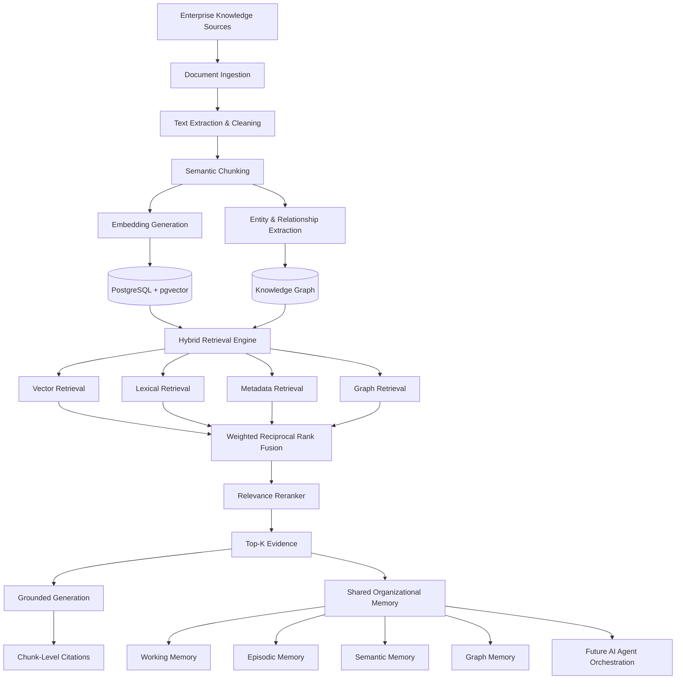

# AgentOS Intelligence

**A Collaborative Organizational Intelligence Layer powered by Hybrid RAG, Knowledge Graphs, and Shared Memory.**

Modern organizations rely on multiple AI tools and fragmented internal knowledge sources that rarely share context. AgentOS Intelligence transforms enterprise documents into a common evidence-backed knowledge layer using semantic embeddings, pgvector, lexical retrieval, metadata, and knowledge graphs.

Instead of making every AI workflow start from zero, AgentOS Intelligence is designed to let future specialized agents reason over the same organizational evidence, memory, and relationships.


---

## The Problem

Modern organizations use multiple independent AI tools, internal documents, business systems, and knowledge sources. These systems operate in silos.

As a result:

- Context is fragmented across documents, departments, and AI conversations.
- Employees repeatedly provide the same information to different tools.
- AI outputs generated in different workflows may conflict.
- Knowledge produced in one workflow is not reusable elsewhere.
- Verification and evidence lineage are weak.
- Specialized AI systems cannot efficiently collaborate on a common organizational context.

---

## Our Solution

AgentOS Intelligence is a **shared organizational intelligence layer** that transforms enterprise documents into searchable semantic knowledge and graph relationships.

The platform ingests multi-format documents, indexes them with real Gemini embeddings stored in pgvector, links the content through a knowledge graph, and retrieves evidence using **hybrid retrieval** (semantic + lexical + metadata + graph). Retrieved evidence is fused, reranked, and exposed through shared organizational memory.

Future AI agents and workflows use this common evidence state rather than operating independently and rediscovering information each time.

> AgentOS Intelligence is **not** simply a chatbot. It is an evidence layer that grounds AI workflows in a reusable, traceable organizational knowledge base.

---

## Why It Is Different

AgentOS Intelligence combines several techniques that are individually familiar but are brought together here in one coherent organizational system:

- **Hybrid retrieval instead of vector-only RAG** — semantic vectors, PostgreSQL full-text search, metadata filters, and knowledge-graph traversal are combined rather than relying on similarity alone.
- **Knowledge-graph-assisted retrieval** — enterprise knowledge is not treated only as text chunks; entities and evidence-backed relationships contribute to retrieval.
- **Shared organizational memory** — working, episodic, semantic, and graph memories persist execution context so future work can build on prior results.
- **Evidence-backed source traceability** — every retrieved result preserves document, page, section, and chunk identifiers, keeping outputs traceable to source evidence.
- **Agent-ready common evidence state** — specialized agents can reason over the same trusted evidence instead of retrieving independently.
- **Future consensus-based knowledge validation** *(planned, not implemented)* — future agents will be able to propose candidate knowledge that is verified before it becomes trusted organizational memory.

> The final point above is currently a **design goal**, not a shipped feature.

---

## System Architecture



---

## Hybrid RAG Pipeline

The retrieval engine runs a single query through multiple parallel channels and combines them into grounded evidence:

```
Query
→ Query Embedding
→ Vector Retrieval
→ Lexical Retrieval
→ Metadata Retrieval
→ Knowledge Graph Retrieval
→ Candidate Deduplication
→ Weighted Reciprocal Rank Fusion
→ Relevance Reranking
→ Top-K Evidence
→ Grounded Response
→ Citations
```

### Weighted Reciprocal Rank Fusion

Because vector similarity, lexical search, metadata, and graph retrieval produce different score scales, the system combines rankings using **Weighted Reciprocal Rank Fusion** rather than directly comparing incompatible raw scores. Each candidate receives a rank-based contribution (weighted by channel) plus a small normalized component boost that preserves score transparency.

The retrieval weights are **configurable heuristic defaults**, not learned or claimed to be mathematically optimal. They are defined in `supabase/functions/_shared/rag/types.ts`.

---

## Document Ingestion Pipeline

```
Upload
→ File validation
→ Parser selection
→ Text extraction
→ Structure preservation
→ Semantic chunking
→ Embedding generation
→ Chunk storage
→ Entity extraction
→ Relationship extraction
→ Knowledge graph update
→ Ready for retrieval
```

### Supported formats (implemented)

| Format | Approach |
|--------|----------|
| PDF | Gemini document extraction (pages, headings, tables) |
| DOCX | ZIP/XML parsing in the edge runtime |
| PPTX | ZIP/XML slide + speaker-note parsing |
| XLSX | ZIP/XML sheet + shared-string parsing |
| CSV | Quote-aware parser (header/row table chunks) |
| TXT | Structure-aware plain-text parsing |
| Markdown | Heading-aware parsing with tables/code blocks |
| PNG / JPG / JPEG / WEBP | Gemini OCR |

Files are validated for extension and size (max 15 MB). Identical normalized chunks reuse an embedding cache; missing chunks are batched through Gemini.

---

## Knowledge Graph

The system extracts organizational entities such as:

`Organization`, `Product`, `Person`, `Employee`, `Team`, `Department`, `Client`, `Project`, `Technology`, `Document`, `Meeting`, `Policy`, `Campaign`, `Decision`, `Location`, `Asset`, `Component`, `Procedure`, `QualityRecord`.

Entities are normalized and stored with aliases and confidence. Every entity mention is tied to one chunk, and every generated relationship stores its source document, source chunk, evidence excerpt, and confidence score.

Example relationship types (implemented in code):

`MEMBER_OF`, `WORKS_ON`, `USES`, `REFERENCES`, `PART_OF`, `TARGETS`, `DISCUSSED_IN`, `DECIDED_IN`, `APPROVED_BY`, `RELATED_TO`, `OWNS`, `CREATED_BY`, `MENTIONS`, `DEPENDS_ON`, `AFFECTS`, `SUPERSEDES`, `REPLACES`, `ASSIGNED_TO`, `EVIDENCED_BY`.

Graph retrieval matches query terms to normalized entities, then walks one or two relationship hops to surface evidence-linked chunks. The Knowledge Graph page reads these database records, lets users filter entity/relationship types, inspect chunk evidence, and expand connected neighbors.

---

## Shared Organizational Memory

AgentOS Intelligence separates memory by purpose so future agents share a common context:

### Working Memory
Current task context — the original/rewritten queries, plan, retrieved evidence chunk IDs, discovered entities, and intermediate outputs for an in-flight execution.

### Episodic Memory
Historical executions and interactions — durable records of past queries, agents used, retrieved citations, final output, confidence, and latency.

### Semantic Memory
Documents, chunks, embeddings, and trusted extracted knowledge — versioned documents, semantic chunks, real embeddings, full-text vectors, and metadata.

### Graph Memory
Entities, relationships, and source-linked graph structure — normalized entities, aliases, evidence-backed relationships, and entity mentions.

Future specialized agents will use this memory layer through shared retrieval services rather than querying tables directly.

---

## Current Implementation Status

### Implemented

- Real Gemini embeddings (`gemini-embedding-001`, 768-dimension) with batching, retry, and content-hash caching
- pgvector semantic search (HNSW cosine)
- PostgreSQL full-text (lexical) retrieval
- Metadata-aware filtering
- Knowledge-graph-assisted retrieval
- Weighted Reciprocal Rank Fusion
- Lightweight relevance reranking (transparent heuristic)
- Duplicate-result suppression
- Chunk-level source citations
- Document ingestion pipeline (multi-format, server-side)
- Knowledge graph entity and relationship extraction with evidence links
- Working memory
- Episodic memory
- Semantic memory
- Graph memory
- Reindex / delete foundation
- Retrieval diagnostics / debug data (RAG Search panel)
- React/TypeScript frontend
- Supabase/PostgreSQL backend with Edge Functions

### In Progress / Planned

- Social Media Agent
- Research Agent
- Verification Agent
- Consensus-based organizational memory
- Dynamic multi-agent orchestration
- Multi-model collaboration
- Full authentication / RBAC
- Permission-aware retrieval
- Temporal knowledge versioning
- RAG evaluation dashboard
- Enterprise connectors
- Advanced recovery / self-healing workflows

> The Social Media Agent, Research Agent, and orchestration scaffolds exist as design/planning modules and are **not** yet connected as live agents. Do not treat them as implemented functionality.

---

## Demo Scenario

**Upload:**
- Product Overview
- Pricing Strategy
- Launch Meeting Notes
- Brand Guidelines

**Ask:**

> "Create a launch-ready summary of the product using the latest approved information."

**What happens:**

1. The system creates structure-aware semantic chunks.
2. Real Gemini embeddings are generated and stored in pgvector.
3. Organizational entities and relationships are extracted into the knowledge graph.
4. Hybrid RAG retrieves evidence across vector, lexical, metadata, and graph channels.
5. Results are fused with weighted RRF and reranked.
6. Gemini generates a grounded answer from the retrieved evidence.
7. The answer includes chunk-level source citations.

In a future release, a Social Media Agent would use the same evidence state to generate platform-specific campaigns — but that agent is **not** yet implemented.

---

## Example Queries

- What features are currently approved for AgentOS?
- What pricing is present in the latest document?
- Which meeting approved the launch decision?
- Which technologies are associated with the product?
- Which campaign is connected to the product?
- What evidence supports this answer?

A fuller set of source-expected queries is available in `fixtures/phase1-demo/RAG_TEST_QUERIES.md`.

---

## Tech Stack

| Layer | Technology |
|-------|-----------|
| **Frontend** | React 18, TypeScript 5, Vite 5, Tailwind CSS, React Flow, shadcn/ui, Recharts |
| **Backend / Data** | Supabase, PostgreSQL, pgvector, Supabase Edge Functions (Deno) |
| **AI / Retrieval** | Google Gemini, semantic embeddings, PostgreSQL FTS, Hybrid RAG, Knowledge Graph, Weighted RRF, relevance reranking |
| **Document Processing** | fflate (ZIP/XML extraction), Gemini-based PDF/OCR extraction, custom CSV/TXT/Markdown parsers |

> Document libraries are listed only where verified in `package.json` / source. No uninstalled libraries are claimed.

---

## Repository Structure

```
.
├── src/
│   ├── components/       # App shell, shared UI, shadcn/ui primitives
│   ├── pages/            # Route pages (Dashboard, Documents, RagSearch, Memory, KnowledgeGraph, etc.)
│   ├── services/         # (see src/lib) API + Supabase clients
│   ├── features/         # Orchestration, shared-memory, social-agent, evaluation scaffolds
│   ├── hooks/            # Shared hooks
│   ├── lib/              # Supabase client, API client, utilities
│   └── types/            # Shared TypeScript types
├── supabase/
│   ├── functions/        # Edge Functions (rag-ingest, forge-ai) + shared RAG library
│   ├── migrations/       # SQL migrations (schema, RLS, RAG, ontology)
│   └── ...
├── fixtures/
│   └── phase1-demo/      # Demo documents + source-expected RAG test queries
├── docs/                 # Architecture, RAG, knowledge graph, memory, submission docs
├── reference/            # Reference material (not compiled into the app)
├── public/
├── .env.example
├── package.json
└── README.md
```

---

## Quick Start

```bash
git clone https://github.com/Nivedita491/AgentOS-Intelligence.git
cd AgentOS-Intelligence
npm install
cp .env.example .env
npm run dev
```

### Supabase setup

1. Create a Supabase project.
2. Apply the migrations under `supabase/migrations/` (e.g., `supabase db push` or run them in the SQL editor). The key RAG migration is `20260807000100_phase1_organizational_rag.sql`.
3. Set Edge Function secrets:

```bash
supabase secrets set GEMINI_API_KEY=...
supabase secrets set SUPABASE_SERVICE_ROLE_KEY=...
```

4. Deploy the Edge Functions:

```bash
supabase functions deploy rag-ingest
supabase functions deploy forge-ai
```

5. Populate `.env` with the Vite-safe Supabase variables (see below).

### Validation commands

```bash
npm run typecheck
npm run lint
npm run build
```

The application uses a structured API validation layer with Zod request/response schemas, standard envelopes, and typed frontend error handling.

---

## Environment Variables

`.env.example` documents the variable names. Never commit real values.

```
VITE_SUPABASE_URL=
VITE_SUPABASE_ANON_KEY=
```

Edge Function secrets (set via `supabase secrets set`, not `.env`):

```
SUPABASE_URL=
SUPABASE_SERVICE_ROLE_KEY=
GEMINI_API_KEY=
```

> `GEMINI_API_KEY` and `SUPABASE_SERVICE_ROLE_KEY` are server-side only and must never be placed in `VITE_*` variables.

---

## Known Limitations

- Advanced multi-agent orchestration is still in progress; orchestration/social-agent modules are scaffolds, not live agents.
- Full authentication / RBAC is not yet production-complete; the demo scopes retrieval to a seeded default organization.
- Graph extraction quality depends on source document quality and the LLM extraction step.
- Large-scale retrieval benchmarking has not yet been completed.
- The relevance reranker is a lightweight transparent heuristic, not a neural cross-encoder.
- The current demo organization uses a seeded/default organization until real membership provisioning is enabled.

---

## Roadmap

| Phase | Scope | Status |
|-------|-------|--------|
| **Phase 1** | Hybrid RAG + Knowledge Graph + Shared Memory | Implemented / core complete |
| **Phase 2** | Research + Social + Verification Agents | In Progress |
| **Phase 3** | Consensus Memory + Dynamic Agent Orchestration | Planned |
| **Phase 4** | Enterprise RBAC + External Connectors + Evaluation | Planned |

---

## Security

- API secrets are not committed and provider keys are server-side only (Edge Functions).
- Supabase Row-Level Security (RLS) is enabled; retrieval RPCs scope queries by organization.
- Uploads are validated for extension and size (max 15 MB).
- `.env.example` is tracked; `.env` and other secret files are ignored.

Full enterprise-grade security (complete RBAC, permission-aware retrieval at the row level for arbitrary tenants, and audit of external connectors) is future work.

---

## Team

Team members are listed in the project metadata where available. *(No additional contributors are claimed beyond the repository's existing attribution.)*

---

## License

This repository's license follows the original project source. See the repository metadata for licensing details.

---

*Built for the hackathon as a single, coherent product: a collaborative organizational intelligence layer powered by Hybrid RAG, knowledge graphs, and shared memory.*
